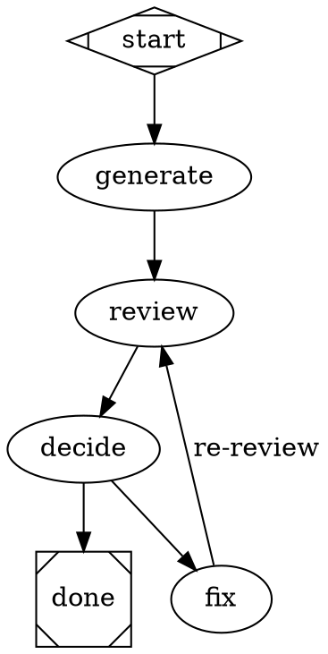

# Attractor

A DOT-based pipeline orchestration engine for multi-stage AI workflows. Define workflows as directed graphs using Graphviz DOT syntax — nodes are tasks, edges are transitions, attributes configure behavior. The result is a declarative, visual, version-controllable pipeline definition.

## Architecture

Attractor is a three-layer stack. Each layer depends only on the one below it:

```
┌─────────────────────────────────────────────────────────┐
│  Attractor Pipeline Engine                              │
│  DOT parser, 9 node handler types, condition DSL,       │
│  model stylesheet, checkpoint/resume, event stream      │
├─────────────────────────────────────────────────────────┤
│  Coding Agent Loop                                      │
│  Autonomous LLM → tool → loop cycle, provider-aligned   │
│  toolsets, execution environment abstraction             │
├─────────────────────────────────────────────────────────┤
│  Unified LLM Client                                     │
│  OpenAI Responses API, Anthropic Messages API,          │
│  Gemini native API — all via native fetch(), no SDKs    │
└─────────────────────────────────────────────────────────┘
```

Each layer is independently useful. You can use the Unified LLM Client without the agent loop, or the agent loop without the pipeline engine.

## Quick Start

### Requirements

- Node.js >= 20.0.0
- At least one LLM provider API key

### Install & Build

```bash
npm install
npm run build
```

### Set Provider API Keys

```bash
export OPENAI_API_KEY="sk-..."
export ANTHROPIC_API_KEY="sk-ant-..."
export GEMINI_API_KEY="..."
```

The client auto-detects which providers are available based on which environment variables are set.

### Usage

#### Unified LLM Client

```typescript
import { llm } from 'attractor';

// Auto-detect providers from environment
const client = llm.Client.from_env();

// High-level generation
const result = await llm.generate({
  model: 'gpt-4',
  prompt: 'Explain the observer pattern in TypeScript',
  client,
});
console.log(result.text);

// Streaming
const stream = llm.stream({
  model: 'claude-sonnet-4-5-20250929',
  prompt: 'Write a haiku about TypeScript',
  client,
});
for await (const event of stream) {
  if (event.type === llm.StreamEventType.TEXT_DELTA) {
    process.stdout.write(event.text);
  }
}

// Structured output
const analysis = await llm.generate_object({
  model: 'gpt-4',
  prompt: 'Analyze the sentiment of: "This library is amazing!"',
  schema: {
    type: 'object',
    properties: {
      sentiment: { type: 'string', enum: ['positive', 'negative', 'neutral'] },
      confidence: { type: 'number', minimum: 0, maximum: 1 },
    },
    required: ['sentiment', 'confidence'],
  },
  client,
});
console.log(analysis.output); // { sentiment: 'positive', confidence: 0.95 }

// Multi-round tool use
const result = await llm.generate({
  model: 'gpt-4',
  prompt: 'What is 42 * 17?',
  tools: [{
    name: 'calculator',
    description: 'Evaluate a math expression',
    parameters: { type: 'object', properties: { expr: { type: 'string' } } },
    execute: async (args) => String(eval(args.expr)),
  }],
  max_tool_rounds: 3,
  client,
});
```

#### Coding Agent Loop

```typescript
import { agent, llm } from 'attractor';

const client = llm.Client.from_env();
const session = new agent.Session({
  provider_profile: agent.createOpenAIProfile(),
  execution_env: new agent.LocalExecutionEnvironment(),
  llm_client: client,
});

// Observe events
session.event_emitter.on(agent.EventKind.TOOL_CALL_START, (data) => {
  console.log(`Calling tool: ${data.tool_name}`);
});

// Submit a task
await session.submit('Create a Python script that reads CSV and outputs JSON');

// Inject steering mid-task
session.steer('Use the pandas library instead of csv module');
```

#### Attractor Pipeline Engine

Define a workflow as a DOT graph:



Run it:

```typescript
import { attractor } from 'attractor';

const engine = new attractor.PipelineEngine({
  logsRoot: './pipeline-logs',
  // Optionally provide an LLM backend for codergen nodes
  backend: myCodergenBackend,
  // Optionally provide a human-in-the-loop implementation
  interviewer: new attractor.ConsoleInterviewer(),
  eventListener: (event) => console.log(event.kind, event.node_id),
});

const result = await engine.runFromSource(dotSource);
console.log(result.status);           // 'success' or 'fail'
console.log(result.completed_nodes);  // ['start', 'generate', 'review', ...]
console.log(result.final_context);    // Runtime context key-value store
```

## Layer Details

### Unified LLM Client (`src/unified-llm/`)

A multi-provider LLM client that uses each provider's **native** API — no external SDK dependencies.

| Provider | API | Adapter |
|----------|-----|---------|
| OpenAI | Responses API (`/v1/responses`) | `OpenAIAdapter` |
| Anthropic | Messages API (`/v1/messages`) | `AnthropicAdapter` |
| Gemini | Generative Language API | `GeminiAdapter` |

Key capabilities:
- **Blocking and streaming** generation with separate methods and return types
- **Tool calling** with automatic multi-round execution and custom stop conditions
- **Structured output** via `generate_object()` — native JSON schema for OpenAI/Gemini, tool-based extraction for Anthropic
- **Middleware chain** for logging, retry, and custom request/response processing
- **Exponential backoff retry** with jitter for transient errors
- **Error hierarchy** — `LLMError` → `AuthenticationError`, `RateLimitError`, `ProviderError`, `TimeoutError`, etc.

### Coding Agent Loop (`src/agent-loop/`)

An autonomous coding agent that pairs an LLM with developer tools through an agentic loop.

Key capabilities:
- **LLM → tool → loop cycle** via `processInput()` — calls the LLM, executes requested tools, feeds results back, repeats until done
- **Provider-aligned toolsets** — each provider gets tools matching its native agent (OpenAI/Codex, Anthropic/Claude Code, Gemini CLI)
- **Session state machine** — IDLE → PROCESSING → AWAITING_INPUT → CLOSED
- **Turn-based history** with automatic truncation to stay within context limits
- **Loop detection** — detects repeating tool call patterns and injects steering
- **Execution environment abstraction** — `LocalExecutionEnvironment` for local dev, interface supports Docker/K8s/WASM
- **SubAgent support** — spawn child agents for parallel work with shared filesystem
- **Event stream** — every LLM call, tool call, and steering injection emits typed events

### Attractor Pipeline Engine (`src/attractor/`)

A DOT-based workflow orchestrator with 9 node handler types.

| Shape/Type | Handler | Purpose |
|------------|---------|---------|
| `Mdiamond` | StartHandler | Pipeline entry point |
| `Msquare` | ExitHandler | Pipeline termination |
| `codergen` | CodergenHandler | LLM generation (default node type) |
| `wait.human` | WaitHumanHandler | Human-in-the-loop gate |
| `conditional` | ConditionalHandler | Branch based on previous outcome |
| `parallel` | ParallelHandler | Fan-out to parallel branches |
| `parallel.fan_in` | FanInHandler | Synchronize parallel branches |
| `tool` | ToolHandler | Direct tool invocation |
| `stack.manager_loop` | StackManagerHandler | Iterative loop management |

Key capabilities:
- **Recursive descent DOT parser** — lexer + parser producing a Graph AST with typed nodes, edges, and attributes
- **Condition expression language** — `outcome=SUCCESS && context.quality>0.8` for edge routing
- **CSS-like model stylesheet** — configure model, provider, and reasoning effort per node using selectors (`*`, `box`, `#node_id`, `.class`)
- **Checkpoint save/resume** — serializable checkpoints after each node for crash recovery
- **Pipeline event stream** — lifecycle events for TUI, web, and IDE frontends
- **Graph-level attributes** — `goal`, `default_max_retries`, `default_model`, etc.
- **Transforms** — pre-parse transformations (variable expansion, stylesheet application)
- **Validation** — structural and semantic validation with custom lint rules

## Specifications

The behavioral specifications are [NLSpecs](https://github.com/0x4D44/strongdm_attractor#terminology) (Natural Language Specs) — human-readable specs designed to be directly usable by coding agents to implement and validate behavior:

- **[Attractor Specification](./attractor-spec.md)** — Pipeline engine, DOT schema, node handlers, conditions, stylesheets, checkpoint/resume
- **[Coding Agent Loop Specification](./coding-agent-loop-spec.md)** — Agentic loop, provider-aligned tools, execution environments, steering, subagents
- **[Unified LLM Client Specification](./unified-llm-spec.md)** — Client architecture, data model, generation/streaming, tool calling, error handling, provider adapters

### Building from Specs

You can implement your own Attractor from the specifications alone:

```
codeagent> Implement Attractor as described by the specs in this repository
```

Supply the specs to any modern coding agent (Claude Code, Codex, OpenCode, Amp, Cursor, etc.) and it will produce a working implementation.

## Development

```bash
npm run build              # TypeScript compilation → dist/
npm run lint               # Type-check only (tsc --noEmit)
npm test                   # Run all 887 tests
npm run test:watch         # Watch mode
npx vitest run --coverage  # Coverage report (90% statements)
npx stryker run            # Mutation testing (85% mutation score)
```

See [TESTS.md](./TESTS.md) for detailed test infrastructure documentation.

## Terminology

- **NLSpec** (Natural Language Spec): A human-readable spec intended to be directly usable by coding agents to implement/validate behavior.
- **Attractor**: The pipeline orchestration engine (this project). Named for the mathematical concept of an attractor — a state toward which a system tends to evolve.
- **DOT**: The Graphviz graph description language used as the pipeline definition format.

## License

Apache-2.0
